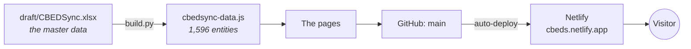
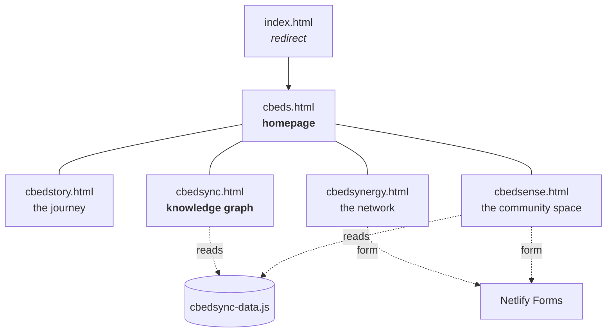
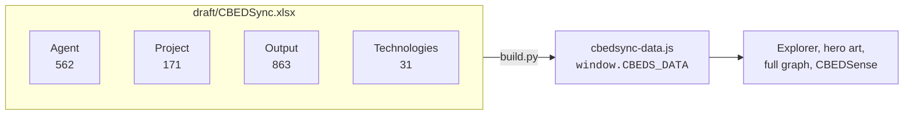
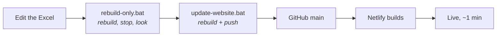
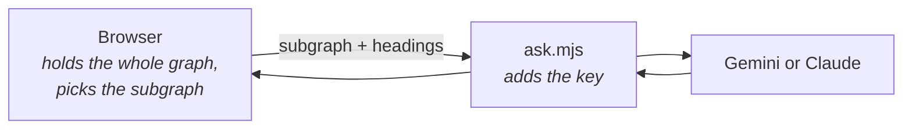

# How the site works

Five HTML pages, no build step, no database, no server. Everything a visitor sees is
a static file. The one exception is a single function that keeps an API key secret.

**Edit the Excel → run one `.bat` → the site changes.** Nothing else touches the data.

---

## The five pages

Only **CBEDSync** and **CBEDSense** load the data file — 143 KB gzipped. The other
three are self-contained, so they stay light.

Each page opens with a full-screen hero built from the same `--hero-h` variable, with
its own canvas or SVG artwork underneath the copy.

---

## Where the data comes from

`build.py` reads four sheets and writes one file. It never writes back.

**`cbedsync-data.js` is generated — never edit it.** Every `.bat` overwrites it.

Fields are read **by position**, so a column inserted mid-sheet shifts everything after
it and the build will publish a wrong graph without complaining. New columns go at the
far right. (`Source` is the one exception — found by its heading.)

---

## Publishing

Netlify redeploys on every push to `main`. There is no build command — it copies the
files as they are.

---

## The one piece of server code

"Ask the graph" on CBEDSync answers from the graph in the browser. If an API key is
set, `netlify/functions/ask.mjs` adds a short AI-written paragraph per section.

The key lives only in Netlify's environment variables — **never in a page**, because
every `.html` and `.js` file is public. Without a key the page falls back to its own
answers, so nothing breaks.

---

## Submissions

Two forms collect entries from outside the team. Nothing they send reaches the site
without a person copying it into the Excel — see
[`SUBMISSIONS.md`](SUBMISSIONS.md).

---

## Files that matter

| | |
|---|---|
| `draft/CBEDSync.xlsx` | **the master data — edit this** |
| `cbedsync-data.js` | generated, 143 KB gzipped, don't edit |
| `build.py` | Excel → data file |
| `*.bat` | rebuild / publish / collect submissions |
| `cbeds-assistant.js` | shared "ask the graph" engine (CBEDSync + CBEDSense) |
| `netlify/functions/ask.mjs` | the only server code; holds no key |
| `.env` | your local keys — git-ignored, never published |

Setup and hosting: [`HOW-TO-HOST-AND-UPDATE.md`](HOW-TO-HOST-AND-UPDATE.md).
