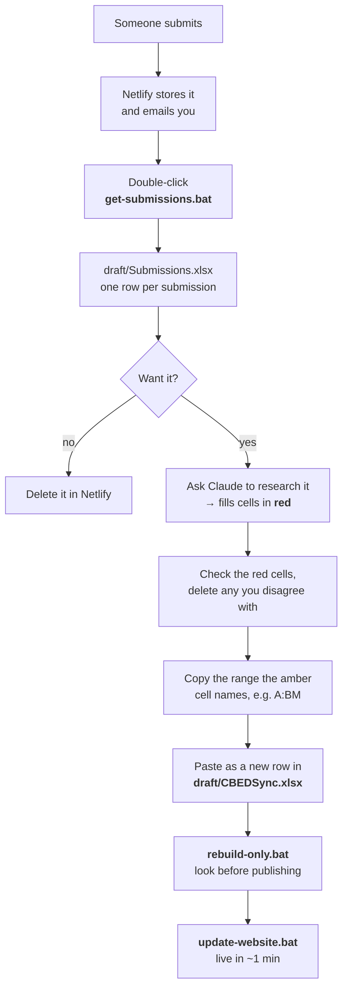

# Handling submissions

Two forms let people outside the team put entries forward: **Share your work**
(CBEDSense) and the **Alliance Charter** (CBEDSynergy).

**Nothing they send reaches the site on its own.** It only gets published if you copy
it into `draft/CBEDSync.xlsx` yourself.

---

## Setup (once)

At **https://app.netlify.com/projects/cbeds/forms**

1. Turn **form detection** on. Two forms appear: `cbeds-charter`, `cbedsense-submission`.
2. Add an **email notification** for each — *before* testing, or you get no email.
3. Make a token at **https://app.netlify.com/user/applications** → paste into `.env`:
   `NETLIFY_TOKEN=…` (git-ignored; if Notepad saves `.env.txt`, set *Save as type: All Files*).

---

## Reading the staging file

| Part | What it is |
|---|---|
| Columns A onwards | The master's own columns. `Source` already says `Public`. |
| **Amber cell, row 1** | Says exactly what to copy, e.g. `← copy A:BM only`. **Read it, don't remember it** — it moves if the master gains or loses a column. |
| Green `Review:` columns | Your notes. Never copied across. |
| **Red text** | A researched suggestion, *not* what the submitter wrote. Check before approving. |

## The research step

Ask Claude, pasting what the run printed. It reads a copy of `CBEDSync.xlsx`,
searches online, and fills in type, dates, location, themes and links — all in red.

Two rules it follows: links only ever point at entities **already in the graph**
(an invented name makes a dead link, not an error), and every suggestion is
explained in `Review: Notes`. It never overwrites anything the submitter typed.

---

## Watch out

- **Never insert a column mid-sheet** in Agent / Project / Output. The build reads by
  position — it will publish a wrong graph without complaining. New columns go at the
  far right.
- **`Source` can't be reconstructed later.** It comes across as `Public` already; don't
  clear it.
- **A Charter signature is two things.** The organisation becomes an Agent row; the
  named lead, date and commitments have no home there — keep those with your
  signatory record.
- `draft/Submissions.xlsx` holds names and emails and is **kept out of GitHub**.
- Free Netlify allows ~100 submissions/month (*Billing → Usage*).

## If it complains

| Message | Meaning |
|---|---|
| `No NETLIFY_TOKEN found` | Step 3 skipped, or Notepad saved `.env.txt` |
| `Netlify refused the token` | Token wrong or revoked — make a new one |
| `Could not find a Netlify project…` | It lists what your token can see; set `NETLIFY_SITE` |
| `No CBEDS forms on cbeds` | Detection off, or no deploy has carried the forms |
| `…does not match the master's columns` | Delete `draft/Submissions.xlsx`, run again (copy out any `Review:` notes first) |
| `no "Source" column on …` | Add `Source` at the far right of that sheet |
| `names shared by more than one entry` | Not an error — two entries share a name, usually a company and its product |
| `Python was not found` | See `HOW-TO-HOST-AND-UPDATE.md` |

## Files

`get-submissions.bat` collect · `rebuild-only.bat` rebuild and stop ·
`update-website.bat` publish · `draft/CBEDSync.xlsx` **the master** ·
`draft/Submissions.xlsx` the waiting room (generated, safe to delete) · `.env` your token

Hosting and the Excel itself: [`HOW-TO-HOST-AND-UPDATE.md`](HOW-TO-HOST-AND-UPDATE.md).
